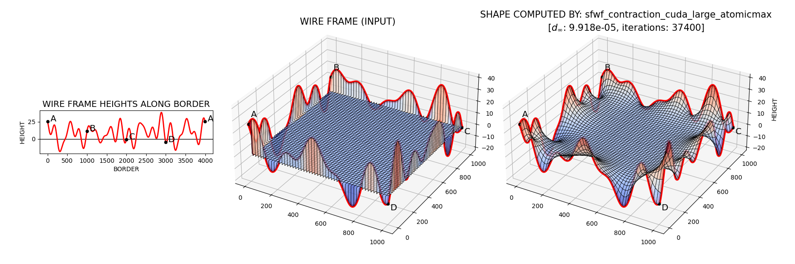
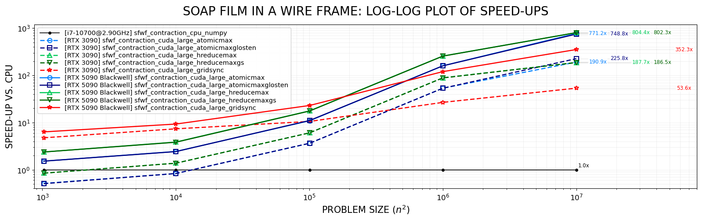

# CUDA contraction iteration for soap film in a wire frame
The repository constitutes a part of research on CUDA computational approaches for algorithms based on contraction mapping theorem due to Banach, a.k.a. the fixed-point theorem.

Imagine a wire frame of irregular shape, forming a closed loop, and a soap film surface spanned within it. The task is to compute the shape of that surface knowing the frame shape.
Solution of this problem can be found numerically by means of stencil computations carried out as a *contraction iteration* procedure.
The repository contains six CUDA implementations of such procedures and two referential CPU-based implementations.

Implementations of CUDA kernels have been carried out using Numba - a just-in-time compiler for Python. Numba exposes a programming interface closely mirroring the native CUDA C++ API, and translates kernel functions into its internal representation (Numba IR), which is then lowered via the LLVM and NVVM-based pipeline into PTX and finally JIT-compiled into executable machine code.

# Speed-ups

# Selected experimental results (averages over 10 repetitions)
| no. | approach (design)                               | iters. | d_inf   (eps: 10-4)   | mean time [s] | speed-up    | mean time [s] | speed-up    |
|:----|:------------------------------------------------|:------------:|:------------------------------------:|--------------:|-------------:|--------------:|-------------:|
|     |                                                 |              |                                      | **(RTX 3090)**| **(RTX 3090)**| **(RTX 5090)**| **(RTX 5090)**|
|     | **problem size: ~103**   (domain grid: 32 $\times$ 32, points: 1 024) |||||||
| 1   | `sfwf_contraction_cpu_numpy`                    | 1 270        | 9.92 $\cdot$ 10-5         | 0.017         | $\times$ 1.0 | 0.007         | $\times$ 2.4 |
| 2   | `sfwf_contraction_cpu_numba_parallel`           | 1 270        | 9.92 $\cdot$ 10-5         | 0.025         | $\times$ 0.7 | 0.020         | $\times$ 0.9 |
| 3   | `sfwf_contraction_cuda_small`                   | 1 270        | 9.92 $\cdot$ 10-5         | 0.006         | $\times$ 2.8 | 0.004         | $\times$ 4.3 |
| 4   | `sfwf_contraction_cuda_large_atomicmax`         | 1 300        | 8.68 $\cdot$ 10-5         | 0.072         | $\times$ 0.2 | 0.025         | $\times$ 0.7 |
| 5   | `sfwf_contraction_cuda_large_atomicmaxglosten`  | 1 300        | 8.68 $\cdot$ 10-5         | 0.072         | $\times$ 0.2 | 0.025         | $\times$ 0.7 |
| 6   | `sfwf_contraction_cuda_large_hreducemax`        | 1 300        | 8.68 $\cdot$ 10-5         | 0.044         | $\times$ 0.4 | 0.016         | $\times$ 1.1 |
| 7   | `sfwf_contraction_cuda_large_hreducemaxgs`      | 1 300        | 8.68 $\cdot$ 10-5         | 0.045         | $\times$ 0.4 | 0.016         | $\times$ 1.1 |
| 8   | `sfwf_contraction_cuda_large_gridsync`          | 1 270        | 9.92 $\cdot$ 10-5         | 0.008         | $\times$ 2.1 | 0.006         | $\times$ 2.8 |
|     | **problem size: ~104**   (domain grid: 100 $\times$ 100, points: 10 000) |||||||
| 9   | `sfwf_contraction_cpu_numpy`                    | 8 365        | 9.92 $\cdot$ 10-5         | 0.262         | $\times$ 1.0 | 0.097         | $\times$ 2.7 |
| 10  | `sfwf_contraction_cpu_numba_parallel`           | 8 365        | 9.92 $\cdot$ 10-5         | 0.365         | $\times$ 0.7 | 0.163         | $\times$ 1.6 |
| 11  | `sfwf_contraction_cuda_large_atomicmax`         | 8 400        | 9.92 $\cdot$ 10-5         | 0.473         | $\times$ 0.6 | 0.163         | $\times$ 1.6 |
| 12  | `sfwf_contraction_cuda_large_atomicmaxglosten`  | 8 400        | 9.92 $\cdot$ 10-5         | 0.468         | $\times$ 0.6 | 0.163         | $\times$ 1.6 |
| 13  | `sfwf_contraction_cuda_large_hreducemax`        | 8 400        | 9.92 $\cdot$ 10-5         | 0.283         | $\times$ 0.9 | 0.101         | $\times$ 2.6 |
| 14  | `sfwf_contraction_cuda_large_hreducemaxgs`      | 8 400        | 9.92 $\cdot$ 10-5         | 0.284         | $\times$ 0.9 | 0.102         | $\times$ 2.6 |
| 15  | `sfwf_contraction_cuda_large_gridsync`          | 8 365        | 9.92 $\cdot$ 10-5         | 0.052         | $\times$ 5.0 | 0.041         | $\times$ 6.4 |
|     | **problem size: ~105**   (domain grid: 317 $\times$ 317, points: 100 489) |||||||
| 16  | `sfwf_contraction_cpu_numpy`                    | 38 235       | 9.97 $\cdot$ 10-5         | 7.054         | $\times$ 1.0 | 2.888         | $\times$ 2.4 |
| 17  | `sfwf_contraction_cpu_numba_parallel`           | 38 235       | 9.97 $\cdot$ 10-5         | 2.664         | $\times$ 2.6 | 1.424         | $\times$ 5.0 |
| 18  | `sfwf_contraction_cuda_large_atomicmax`         | 38 300       | 9.92 $\cdot$ 10-5         | 2.055         | $\times$ 3.4 | 0.737         | $\times$ 9.6 |
| 19  | `sfwf_contraction_cuda_large_atomicmaxglosten`  | 38 300       | 9.92 $\cdot$ 10-5         | 2.065         | $\times$ 3.4 | 0.741         | $\times$ 9.5 |
| 20  | `sfwf_contraction_cuda_large_hreducemax`        | 38 300       | 9.92 $\cdot$ 10-5         | 1.235         | $\times$ 5.7 | 0.460         | $\times$ 15.3|
| 21  | `sfwf_contraction_cuda_large_hreducemaxgs`      | 38 300       | 9.92 $\cdot$ 10-5         | 1.244         | $\times$ 5.7 | 0.463         | $\times$ 15.2|
| 22  | `sfwf_contraction_cuda_large_gridsync`          | 38 235       | 9.97 $\cdot$ 10-5         | 0.786         | $\times$ 9.0 | 0.334         | $\times$ 21.1|
|     | **problem size: ~106**   (domain grid: 1 000 $\times$ 1 000, points: 1 000 000) |||||||
| 23  | `sfwf_contraction_cpu_numpy`                    | 37 329       | 9.97 $\cdot$ 10-5         | 71.297        | $\times$ 1.0 | 26.448        | $\times$ 2.7 |
| 24  | `sfwf_contraction_cpu_numba_parallel`           | 37 329       | 9.97 $\cdot$ 10-5         | 10.428        | $\times$ 6.8 | 4.847         | $\times$ 14.7|
| 25  | `sfwf_contraction_cuda_large_atomicmax`         | 37 400       | 9.92 $\cdot$ 10-5         | 2.076         | $\times$ 34.3| 0.738         | $\times$ 96.6|
| 26  | `sfwf_contraction_cuda_large_atomicmaxglosten`  | 37 400       | 9.92 $\cdot$ 10-5         | 2.076         | $\times$ 34.3| 0.736         | $\times$ 96.9|
| 27  | `sfwf_contraction_cuda_large_hreducemax`        | 37 400       | 9.92 $\cdot$ 10-5         | 1.251         | $\times$ 57.0| 0.460         | $\times$ 155.0|
| 28  | `sfwf_contraction_cuda_large_hreducemaxgs`      | 37 400       | 9.92 $\cdot$ 10-5         | 1.250         | $\times$ 57.0| 0.459         | $\times$ 155.3|
| 29  | `sfwf_contraction_cuda_large_gridsync`          | 37 329       | 9.97 $\cdot$ 10-5         | 4.178         | $\times$ 17.1| 0.988         | $\times$ 72.2|
|     | **problem size: ~107**   (domain grid: 3 163 $\times$ 3 163, points: 10 004 569) |||||||
| 30  | `sfwf_contraction_cpu_numpy`                    | 71 513       | 9.92 $\cdot$ 10-5         | 2 712.149     | $\times$ 1.0 | 1 770.113     | $\times$ 1.5 |
| 31  | `sfwf_contraction_cpu_numba_parallel`           | 71 513       | 9.92 $\cdot$ 10-5         | 400.334       | $\times$ 6.8 | 146.057       | $\times$ 18.6|
| 32  | `sfwf_contraction_cuda_large_atomicmax`         | 71 600       | 9.92 $\cdot$ 10-5         | 20.209        | $\times$ 134.2| 5.015         | $\times$ 540.8|
| 33  | `sfwf_contraction_cuda_large_atomicmaxglosten`  | 71 600       | 9.92 $\cdot$ 10-5         | 15.325        | $\times$ 177.0| 4.066         | $\times$ 667.0|
| 34  | `sfwf_contraction_cuda_large_hreducemax`        | 71 600       | 9.92 $\cdot$ 10-5         | 19.960        | $\times$ 135.9| 4.861         | $\times$ 557.9|
| 35  | `sfwf_contraction_cuda_large_hreducemaxgs`      | 71 600       | 9.92 $\cdot$ 10-5         | 19.935        | $\times$ 136.0| 4.855         | $\times$ 558.6|
| 36  | `sfwf_contraction_cuda_large_gridsync`          | 71 513       | 9.97 $\cdot$ 10-5         | 75.746        | $\times$ 35.8 | 12.724        | $\times$ 213.2|

# Basic usage for default settings
TODO

# Configuration and other settings
TODO

# Acknowledgements
- [Numba](https://numba.pydata.org): a high-performance just-in-time Python compiler.
